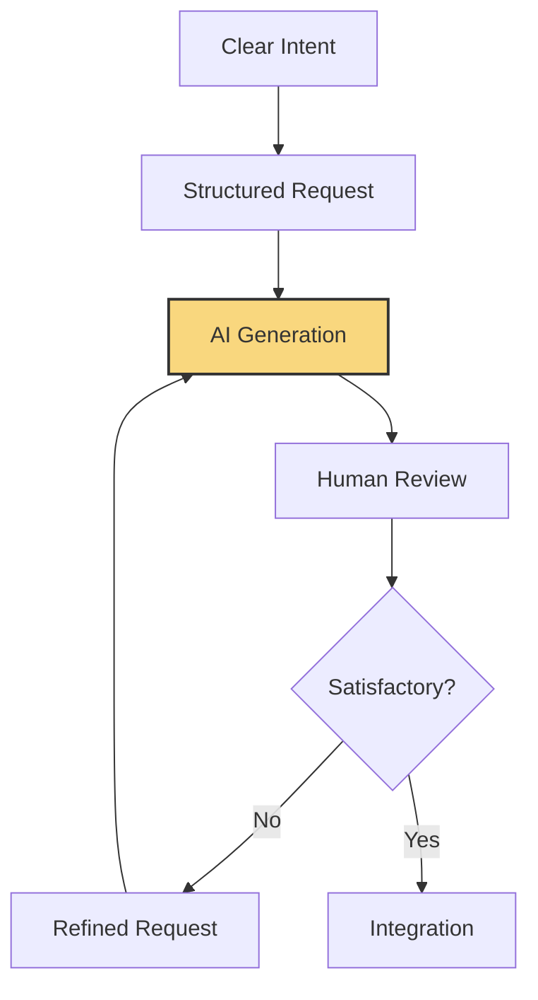

#  GETTING STARTED WITH VIBE CODING

<i>"From concept to code: Your first steps in AI-human collaboration"</i>

---

## 🚀 Chapter Overview

Chapter 2 takes you from understanding the concepts to practical application. Here you'll learn the essential tools, techniques, and patterns that form the foundation of effective Vibe Coding. By the end of this chapter, you'll have completed your first AI-collaborative project and be ready to apply these skills to your own work.

---

## 📚 What You'll Learn

- Setting up an optimal Vibe Coding environment
- Essential tools, frameworks, and platforms for AI collaboration
- Effective communication patterns with AI assistants
- Structuring projects for maximum AI collaboration efficiency
- Recognizing and avoiding common pitfalls in AI-assisted development

---

## 🎯 Target Audience

This chapter comes in three versions tailored to different experience levels:

<table>
  <tr>
    <td align="center"><b><a href="./Chapter_02_Beginner.md">🌱 BEGINNER</a></b></td>
    <td>For those new to development, with step-by-step guidance on setting up your first AI-collaborative environment and creating simple projects with minimal coding knowledge.</td>
  </tr>
  <tr>
    <td align="center"><b><a href="./Chapter_02_Advanced.md">🔧 ADVANCED</a></b></td>
    <td>For professional developers, focusing on integrating AI assistance into existing workflows and leveraging advanced features for increased productivity in complex projects.</td>
  </tr>
  <tr>
    <td align="center"><b><a href="./Chapter_02_Ninja.md">⚡ NINJA</a></b></td>
    <td>For experts and innovators, exploring cutting-edge techniques, custom tooling, and advanced patterns for pushing the boundaries of what's possible with AI collaboration.</td>
  </tr>
</table>

---

## 💻 Featured Tools & Technologies

  <table>
    <tr>
      <td align="center"><b>Development Environments</b></td>
      <td align="center"><b>AI Collaboration Platforms</b></td>
      <td align="center"><b>Supporting Technologies</b></td>
    </tr>
    <tr>
      <td>
        • VS Code with AI extensions 
        • Windsurf IDE 
        • Cursor 
        • JetBrains AI Assistant
      </td>
      <td>
        • OpenAI API 
        • GitHub Copilot 
        • Anthropic Claude 
        • Bard Advanced
      </td>
      <td>
        • Prompt libraries 
        • Vector databases 
        • Context management tools 
        • Code quality analyzers
      </td>
    </tr>
  </table>

---

## 🧪 Hands-On Projects

<table>
  <tr>
    <td width="33%" align="center">
      <h3>🌱 Beginner Project</h3>
      
Personal dashboard with weather, tasks and notes

    </td>
    <td width="33%" align="center">
      <h3>🔧 Advanced Project</h3>
      
Full-stack web application with AI-generated components

    </td>
    <td width="33%" align="center">
      <h3>⚡ Ninja Project</h3>
      
Custom AI collaboration tool with specialized capabilities

    </td>
  </tr>
</table>

---

## 💬 Communication Patterns

Learn the essential patterns for effective AI collaboration:

---

