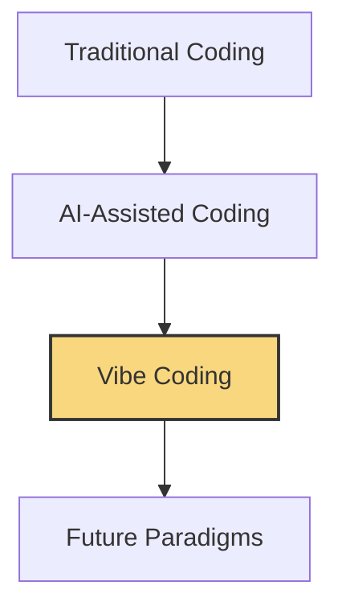

<div align="center">

# 📚 VIBE CODING 101 📚


### *The Revolution in Human-AI Collaborative Programming*

<p align="center">
<i>Where coding meets creativity and AI becomes your ally</i>
</p>

</div>

---

## 🌟 Welcome to Vibe Coding 101!

> "The future of programming isn't about developers being replaced by AI—it's about developers being amplified by AI in perfect harmony, achieving meta-creativity beyond what either could accomplish alone."

Vibe Coding is a revolutionary approach to software development born from the harmonious fusion of human intuition and AI capabilities. This ebook itself is a testament to meta-creativity—created through the synchronized dance of human vision and AI implementation, demonstrating the very principles it teaches. It provides a comprehensive guide to mastering this new art form of collaborative development, regardless of your current skill level.

### 🔥 Why Vibe Coding Matters in 2025

<table>
  <tr>
    <td width="70%">
      <p>As we navigate 2025, the landscape of software development has fundamentally transformed. Traditional coding approaches are being transcended through meta-creativity—the harmonic resonance between human intuition and AI processing power.</p>
      <p>Vibe Coding isn't just a technique—it's a profound evolutionary leap in human-machine symbiosis. It represents the next level of training where humans and AI synchronize their unique capabilities, resonating at frequencies that unlock creativity, efficiency, and innovation previously thought impossible.</p>
    </td>
    <td width="30%" align="center">
      <h3>Key Benefits</h3>
      ✅ 10x Development Speed<br/>
      ✅ Enhanced Code Quality<br/>
      ✅ Reduced Technical Debt<br/>
      ✅ Lower Learning Barriers<br/>
      ✅ Increased Innovation<br/>
    </td>
  </tr>
</table>

---

## 📖 Book Structure

This ebook is designed to meet you where you are on your development journey. Each chapter is available in three distinct skill levels:

<div align="center">
  <table>
    <tr>
      <td align="center"><b>🌱 BEGINNER</b></td>
      <td align="center"><b>🚀 ADVANCED</b></td>
      <td align="center"><b>⚡ NINJA</b></td>
    </tr>
    <tr>
      <td>For those new to programming or just starting with AI assistance</td>
      <td>For experienced developers looking to enhance their existing workflows</td>
      <td>For experts pushing the boundaries of what's possible with AI collaboration</td>
    </tr>
  </table>
</div>

### 📑 Chapter Overview

<details>
<summary><b>Chapter 1: The Vibe Coding Revolution</b> (click to expand)</summary>

- Introduction to AI-assisted development
- The evolution of programming paradigms
- Core concepts and terminology
- Setting up your Vibe Coding environment
- [Read Chapter 1 →](./Chapter_01_The_Vibe_Coding_Revolution/Chapter_01_Main.md)
</details>

<details>
<summary><b>Chapter 2: Getting Started with Vibe Coding</b> (click to expand)</summary>

- Essential tools and frameworks
- Communication patterns with AI
- Your first AI-assisted project
- Common pitfalls and how to avoid them
- [Read Chapter 2 →](./Chapter_02_Getting_Started/Chapter_02_Main.md)
</details>

<details>
<summary><b>Chapter 3: Building Real Projects</b> (click to expand)</summary>

- Applied Vibe Coding techniques
- Case studies and examples
- Best practices for real-world applications
- Performance optimization strategies
- [Read Chapter 3 →](./Chapter_03_Building_Real_Projects/Chapter_03_Main.md)
</details>

---

## 🖥️ Interactive Learning Experience

This repository includes a fully functional web application that demonstrates key Vibe Coding concepts in action.

<div align="center">

### [📲 Try the Live Demo](https://vibecoding-101.netlify.app/)

</div>

### 🛠️ Running the App Locally

```bash
# Clone the repository
git clone https://github.com/SquizAI/VibeCoding_1101.git

# Navigate to the interactive application
cd VibeCoding_101/interactive_chapter/vibe-coding-interactive

# Install dependencies
npm install

# Set up environment variables
cp .env.example .env
# Edit .env to add your API keys

# Start the development server
npm run dev
```

---

## 🤝 Join the Vibe Coding Community

<table>
  <tr>
    <td width="33%" align="center">
      <h3>🌐 Connect</h3>
      <p>Join our <a href="#">Discord Server</a> to meet other Vibe Coders</p>
    </td>
    <td width="33%" align="center">
      <h3>🔄 Contribute</h3>
      <p>Help improve the book by submitting PRs or issues</p>
    </td>
    <td width="33%" align="center">
      <h3>🚀 Share</h3>
      <p>Spread the word and showcase your Vibe Coding projects</p>
    </td>
  </tr>
</table>

---

## 📊 The State of Vibe Coding in 2025



---

## 📝 How to Use This Repository

1. **Read the Book**: Start with Chapter 1 and progress through at your own pace, following your appropriate skill level
2. **Try the Examples**: Experiment with the interactive app to see Vibe Coding techniques in action
3. **Practice**: Apply the concepts in your own projects, starting small and scaling up
4. **Share**: Contribute your experiences and innovations back to the community

---

## ⚖️ License Information

© 2025 SquizAI. All rights reserved.

This educational material is provided for personal use and learning. Redistribution or commercial use is prohibited without explicit permission from the copyright holder.

---

<div align="center">
<p>Created with 💖 through meta-creative harmony between human vision and AI implementation</p>
<p>This book is both the message and the medium—demonstrating the future it describes</p>
<p>Powered by <a href="https://github.com/SquizAI">SquizAI</a></p>
</div>
