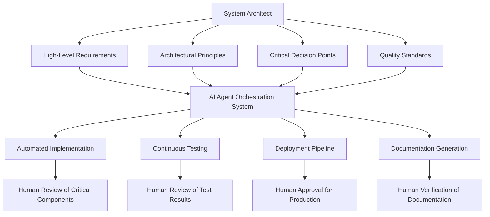

<div align="center">

# 💻 Chapter 03: Building Real Projects with AI Assistance - Expert-Level Strategies For System Architects ⚔️

</div>

<div align="center">

## Vibe Coding: Where Human Creativity Meets AI Capabilities

</div>

<div align="center">

> *"The master developer orchestrates AI capabilities to build systems beyond conventional limitations"*

</div>

---

## ⚡ Mastering AI-Augmented Development in 2025

At the expert level, you're not merely using AI as a tool but orchestrating an entire AI-augmented development ecosystem. The 2025 landscape provides unprecedented capabilities that transform how systems architects approach complex, large-scale projects. This section explores cutting-edge techniques for leveraging AI as a true force multiplier in enterprise and mission-critical system development.

## 🔄 Enterprise-Grade Multi-Agent Development Frameworks

### Advanced Agent Orchestration Systems

In 2025, expert developers leverage sophisticated multi-agent systems where specialized AI agents collaborate autonomously to solve complex development challenges while maintaining human oversight for critical decisions.

#### Agent Specialization Framework

Create a coordinated team of specialized AI agents with clearly defined roles and communication protocols:

1. **Enterprise Architect Agent**: Uses Claude-Next for comprehensive system design with full business context awareness
2. **Domain Specialist Agents**: Multiple specialized agents focusing on different business domains
3. **Implementation Agents**: Assign microservice, frontend, and database implementation to specialized coding agents
4. **Testing/QA Orchestrator**: Coordinates test generation, execution, and validation across the entire system
5. **Security Assessment Agent**: Performs continuous security analysis, penetration testing, and compliance verification
6. **DevOps Engineer Agent**: Manages infrastructure code, deployment pipelines, and operational tooling
7. **Documentation & Knowledge Agent**: Maintains comprehensive system documentation and knowledge base

#### Inter-Agent Communication Protocol:

```yaml
communication:
  protocol: event-driven
  message_format: structured_json
  context_management:
    shared_context_store: true
    specialized_context_by_agent: true
  information_sharing:
    cross_agent_knowledge_base: true
    decision_history_tracking: true
  conflict_resolution:
    authority_hierarchy: defined
    consensus_mechanisms: enabled
    human_escalation_paths: explicit
```

#### Modern Agent Orchestration Tools

- **Cascade by Codeium**: Advanced agent capabilities in Windsurf for multi-step task execution
- **GitHub Copilot Enterprise**: Specialized agents for different aspects of the GitHub ecosystem
- **Cursor Composer**: Multi-file, multi-component coordination
- **Custom LangChain Frameworks**: For building specialized agent systems with explicit coordination

### Autonomous Development Orchestration

Implement fully autonomous development workflows with strategic human touchpoints, transforming system architects into orchestrators rather than implementers:

#### Complete CI/CD Pipeline Integration

1. **Requirements Engineering Automation**: 
   - Use AI to transform business objectives into formal requirements with traceability
   - Automatically detect contradictions, ambiguities, and edge cases
   - Generate acceptance criteria with measurable outcomes
   - Map requirements to architectural components

2. **Architecture-Driven Development**:
   - Convert high-level architectural decisions into detailed technical designs
   - Automatically generate consistency checks across architectural boundaries
   - Create visual architecture diagrams synchronized with implementation
   - Validate architectural compliance through automated reviews

3. **Code Generation with Architectural Awareness**:
   - Maintain architectural integrity through constrained generation
   - Implement cross-cutting concerns consistently (security, logging, monitoring)
   - Generate comprehensive integration tests verifying architectural constraints
   - Automatically detect architectural drift

4. **Autonomous Quality Assurance**:
   - Generate specialized tests for performance, security, reliability, and scalability
   - Automatically detect code smells and suggest refactorings
   - Perform continuous security analysis and vulnerability testing
   - Generate synthetic test data reflecting real-world usage patterns

5. **LiveOps and Monitoring Integration**:
   - Generate comprehensive observability instrumentation
   - Create intelligent alerting based on business impact
   - Implement automated remediation for common issues
   - Design chaos engineering scenarios for resilience testing

#### Enterprise AI Orchestra Coordinator Role

As a system architect in 2025, your most valuable contribution is high-level orchestration:



## 🧪 Experimental Development Paradigms

### Inverse Development

Start with tests and expected outputs, then generate implementations:

1. **Outcome definition**: Precisely define expected system behavior
2. **Test-first generation**: Create comprehensive test suites before any implementation
3. **Implementation synthesis**: Generate code that satisfies all test conditions
4. **Property verification**: Formally verify implementation properties

#### Example Prompt:
```
I need an implementation of a distributed rate limiting system that satisfies these properties:
1. Must handle 10,000 requests per second across 5 service instances
2. Must guarantee no more than X requests per user per minute
3. Must recover from instance failures within 5 seconds
4. Must not lose tracking data during network partitions
5. Must have O(1) time complexity for rate check operations

Here are the test scenarios:
[detailed test scenarios]

Please generate:
1. A suitable distributed algorithm for this problem
2. Implementation in Go with detailed comments
3. Proof of correctness for the key properties
4. Performance analysis under different load conditions
```

### Emergent System Design

Build systems through evolutionary approaches:

1. **Seed implementation**: Start with minimal working system
2. **Evolutionary pressure**: Define selection criteria for improvements
3. **Variation generation**: Create multiple alternative implementations
4. **Selection mechanism**: Evaluate and select optimal variations
5. **Integration strategy**: Combine successful elements into next generation

## 🛠️ Advanced LLM Techniques for Enterprise Systems

### Enterprise-Specific Model Adaptation in 2025

The landscape of AI customization has evolved significantly in 2025, with several approaches available for tailoring AI capabilities to enterprise needs without traditional fine-tuning:

#### RAG-Based Enterprise Knowledge Integration

1. **Knowledge Corpus Creation**:
   - Extract architectural knowledge from existing systems
   - Organize APIs, design patterns, and internal frameworks
   - Create semantic embeddings of enterprise codebase
   - Build hierarchical knowledge structures of domain expertise

2. **Custom Retrieval Pipelines**:
   - Design specialized retrievers for different knowledge types
   - Implement context-aware query planning
   - Create hybrid retrieval strategies (dense + sparse + graph-based)
   - Build ranking systems for enterprise relevance

3. **Contextual Adaptation Systems**:
   - Develop context management frameworks for long-running projects
   - Create specialized tool integrations for enterprise systems
   - Build custom chat interfaces with enterprise authentication
   - Design prompt templates with enterprise constraints embedded

#### Modern Enterprise AI Customization Tools

- **Langchain Enterprise**: Building custom RAG pipelines with enterprise data integration
- **GitHub Copilot Enterprise**: Organization-specific customization and policy management
- **Claude-Next with custom knowledge bases**: Knowledge integration without model retraining
- **Cursor Rules**: Creating customized coding standards and patterns

## 🛡️ Enterprise-Scale Security Architecture

### AI-Driven Security Architecture Design

Leverage advanced AI capabilities to infuse security into every aspect of development from design through production:

#### Advanced Security Approaches for 2025

1. **AI-Augmented Threat Modeling**:
   - Generate comprehensive threat models from architectural designs
   - Continuously update threat landscape based on emerging vulnerabilities
   - Create attack path visualizations with risk quantification
   - Develop mitigations prioritized by business impact

2. **Zero Trust Architecture Automation**:
   - Design identity and access patterns with least privilege principles
   - Create service-to-service authentication frameworks
   - Generate infrastructure as code with security guardrails
   - Build comprehensive audit and verification systems

3. **Regulatory Compliance Automation**:
   - Map system components to compliance requirements
   - Generate compliance documentation from implementation
   - Create automated evidence collection for audits
   - Design policy enforcement points across the architecture

4. **Integrated Security Testing**:
   - Generate comprehensive security test suites from threat models
   - Create fuzz testing scenarios for critical interfaces
   - Implement chaos security engineering approaches
   - Design penetration testing automation frameworks

5. **Supply Chain Security**:
   - Build software bill of materials (SBOM) automation
   - Create dependency vulnerability scanning and remediation
   - Implement secure deployment pipelines with verification
   - Design secure artifact management with cryptographic verification

#### Modern Security Tools

- **DeepCode AI**: Advanced security vulnerability detection
- **GitHub Advanced Security**: Supply chain and dependency analysis
- **Cursor with Security Extensions**: Secure coding pattern implementation
- **Claude-Next**: Comprehensive security architecture analysis

## 📚 Enterprise Pattern Libraries

### Building Organizational Knowledge Assets

Create sophisticated organization-specific implementation pattern libraries that encode best practices and accelerate development:

#### Advanced Pattern Library Development

1. **Pattern Mining and Extraction**:
   - Use AI to analyze codebases and identify emergent patterns
   - Create quantifiable metrics for pattern effectiveness
   - Build pattern catalogs with context-specific variations
   - Design pattern evolution frameworks based on usage data

2. **Pattern Formalization and Governance**:
   - Create executable specifications for patterns
   - Build comprehensive validation suites for pattern implementations
   - Design pattern approval workflows for enterprise adoption
   - Implement pattern versioning and deprecation strategies

3. **Pattern Distribution Systems**:
   - Create searchable pattern repositories with usage analytics
   - Build IDE integrations for pattern application
   - Design pattern education and training materials
   - Implement pattern recommendation engines based on context

4. **Pattern Optimization**:
   - Create performance benchmarks for pattern implementations
   - Design specialized variations for different contexts
   - Build compatibility layers for legacy integration
   - Implement automated pattern upgrades and migrations

#### Modern Pattern Library Tools

- **GitHub Enterprise**: Pattern repositories with usage tracking
- **Custom Copilot Knowledge Bases**: Pattern-aware AI assistance
- **Cursor Rules**: Pattern enforcement during development
- **Internal RAG Systems**: Organizational knowledge retrieval

## 🤓 Advanced Prompt Engineering For System Design

### Meta-Prompting Techniques for Enterprise Architects

Create sophisticated prompting systems that transform high-level architectural concepts into implementable designs:

#### Enterprise Architectural Prompting Frameworks

1. **Architectural Decision Records (ADR) Generation**:
   - Automatically document significant design decisions with rationale
   - Maintain traceability between requirements and architectural choices
   - Generate alternative approaches with trade-off analysis
   - Create searchable knowledge base of architectural decisions

2. **System Composition Prompting**:
   - Design prompts that generate entire system architectures
   - Create component relationship definitions with well-defined interfaces
   - Generate architecture diagrams with multiple views (C4 model)
   - Build cross-cutting concern specifications (security, observability)

3. **Quality Attribute Refinement**:
   - Develop specialized prompts for each quality attribute (performance, security, scalability)
   - Create constraints and validation criteria for architectural compliance
   - Generate test frameworks for quality attribute verification
   - Define SLOs and monitoring requirements for production systems

4. **Enterprise Integration Prompting**:
   - Design prompts for system boundary definitions
   - Create API contracts with comprehensive validation
   - Generate event schemas with versioning strategies
   - Build security and compliance requirements into integration specifications

#### Advanced Prompting Tools

- **Claude-Next with 200K token context**: For comprehensive system context in prompts
- **GitHub Copilot Enterprise**: Organization-specific prompt templates
- **Custom LangChain Templates**: For creating specialized prompting frameworks
- **Visual Architecture Tools with AI Integration**: For diagram-based prompting


### Meta-Learning Systems

Create systems that improve their own learning process:

1. **Learning algorithm generation**: Develop specialized learning algorithms
2. **Training data synthesis**: Generate optimal training data
3. **Transfer learning optimization**: Maximize knowledge transfer between tasks
4. **Continuous improvement loops**: Implement systems that get better over time

## 🛠️ Implementation Case Study: Distributed AI Orchestration System

Let's build a distributed system for AI orchestration:

1. **Service Mesh Architecture**:
   - Sidecar proxies for service communication
   - Control plane for configuration management
   - Data plane for request routing

2. **Agent Coordination Protocol**:
   - Event-driven communication
   - State synchronization mechanisms
   - Conflict resolution strategies

3. **Resource Optimization Engine**:
   - Dynamic resource allocation
   - Predictive scaling
   - Cost optimization algorithms

4. **Security Framework**:
   - Zero-trust architecture
   - Cryptographic identity verification
   - Fine-grained access control

## 🔍 Verification and Validation

For mission-critical systems:

1. **Formal methods integration**: Apply theorem proving for critical components
2. **Statistical guarantees**: Calculate reliability bounds mathematically
3. **Chaos engineering**: Implement sophisticated failure testing
4. **Property-based testing**: Generate thousands of test cases automatically

## 🌐 Scaling Strategies

For systems that need to scale globally:

1. **Global distribution designs**: Architecture for worldwide deployment
2. **Multi-region consistency**: Strategies for data consistency across regions
3. **Edge computing integration**: Pushing computation to network edges
4. **Hierarchical scaling patterns**: Nested scaling architectures

---

<div align="center">

**[⬅️ Previous Chapter](../Chapter_02_Getting_Started_with_Vibe_Coding/Chapter_02_Ninja.md) | [📚 Table of Contents](../index.md)**

</div>

<div align="center">

**[📚 Main Content](./Chapter_03_Main.md) | [🔰 Beginner](./Chapter_03_Beginner.md) | [⚙️ Advanced](./Chapter_03_Advanced.md)**

</div>

<div align="center">

*© 2025 VibeCoding - Where Human Creativity Meets AI Capabilities*

</div>
