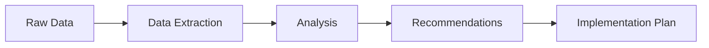

<div align="center">

# ⚡ Advanced Prompt Engineering: Advanced Level ⚡

</div>

<div align="center">


</div>

<div align="center">

> *"Mastering the subtle art of AI communication is the competitive advantage of 2025"*

</div>

---

## 🌐 Advanced Prompt Engineering in the 2025 Landscape

As AI systems have grown more sophisticated, prompt engineering has evolved from a simple skill into a strategic discipline. For experienced developers, prompt engineering in 2025 has become a powerful tool that can significantly enhance productivity, problem-solving capabilities, and application development.

This chapter explores advanced prompt engineering techniques, structured frameworks, and emerging trends that enable seasoned developers to leverage AI systems with greater precision and effectiveness.

## 📊 Structured Prompt Frameworks

The formalization of prompt engineering has led to the development of robust frameworks that consistently produce high-quality results.

### The Four-Pillar Framework

This structured approach ensures comprehensive prompt design:

1. **Task Definition**: Clear specification of what the AI needs to accomplish
2. **Context Provision**: Relevant background information, constraints, and domain knowledge
3. **Output Specification**: Detailed requirements for format, style, and structure
4. **Evaluation Criteria**: Standards for assessing quality and compliance of the output

```
# Structured Prompt Example

## TASK
Develop an optimized database schema for a multi-tenant SaaS application that tracks customer orders across regional warehouses.

## CONTEXT
- The application serves businesses in retail with varying inventory needs
- Must support high-volume transaction processing (>10,000 orders/day)
- Compliance with GDPR and data localization requirements is essential
- System will run on PostgreSQL 16 in a cloud environment

## OUTPUT
- Complete schema definition with tables, relationships, and indices
- SQL implementation script
- Documentation explaining design decisions and optimization strategies
- Consideration of partitioning strategy for scalability

## EVALUATION
- Normalized to minimize redundancy while optimizing for read performance
- Proper indexing strategy for common query patterns
- Effective handling of multi-tenancy without data leakage risks
- Clear adherence to naming conventions and industry best practices
```

### The PTCF (Persona-Task-Context-Format) Approach

This framework enhances role-based prompting for specialized outcomes:

- **Persona**: Define the expert role the AI should adopt
- **Task**: Specify the precise action to perform
- **Context**: Provide necessary background and constraints
- **Format**: Dictate the structure and style of the response

```
# PTCF Framework Example

## PERSONA
You are a senior software architect with 15 years of experience in distributed systems and microservices architecture.

## TASK
Analyze the following system design and identify potential bottlenecks, single points of failure, and scalability limitations.

## CONTEXT
[System diagram and specification details]

The system needs to handle peak loads of 50,000 concurrent users and maintain 99.99% uptime. Budget constraints limit cloud resources to $15,000/month.

## FORMAT
Provide your analysis in the following sections:
1. Architecture Review (high-level assessment)
2. Critical Vulnerabilities (prioritized list)
3. Scalability Analysis (with specific metrics)
4. Recommendations (categorized as immediate, short-term, and long-term)
5. Implementation Roadmap (with effort estimates)
```

## 🛠️ Advanced Prompt Engineering Techniques

### Chain-of-Thought (CoT) Prompting

Enhancing reasoning capabilities through structured thinking:

- Guide the AI model through a step-by-step reasoning process
- Particularly effective for complex problem-solving, algorithmic tasks, and logical reasoning
- Dramatically improves accuracy for multi-step problems

```
Analyze the time and space complexity of the following algorithm:

```python
def process_network(nodes, edges):
    graph = {}
    for node in nodes:
        graph[node] = []
    
    for source, target, weight in edges:
        graph[source].append((target, weight))
    
    distances = {node: float('infinity') for node in nodes}
    distances[nodes[0]] = 0
    priority_queue = [(0, nodes[0])]
    
    while priority_queue:
        current_distance, current_node = heapq.heappop(priority_queue)
        if current_distance > distances[current_node]:
            continue
        
        for neighbor, weight in graph[current_node]:
            distance = current_distance + weight
            if distance < distances[neighbor]:
                distances[neighbor] = distance
                heapq.heappush(priority_queue, (distance, neighbor))
    
    return distances
```

Think through this step by step:
1. First, identify the key data structures used
2. Analyze the initialization phase
3. Examine the main processing loop
4. Determine the worst-case number of operations
5. Calculate the final time complexity using Big O notation
6. Analyze the space requirements
7. Provide the final space complexity
```

### Few-Shot Learning

Leveraging examples to improve performance:

- Provide multiple examples of input-output pairs to establish patterns
- Particularly effective for tasks with specific formats or styles
- Can significantly reduce hallucinations and improve consistency

```
# Converting API specifications to TypeScript interfaces

## Example 1:
API Response:
```json
{
  "user": {
    "id": 123,
    "name": "John Doe",
    "email": "john@example.com",
    "roles": ["admin", "editor"],
    "metadata": {
      "lastLogin": "2025-01-15T14:30:00Z",
      "preferences": { "theme": "dark" }
    }
  }
}
```

TypeScript Interface:
```typescript
interface UserMetadata {
  lastLogin: string;
  preferences: {
    theme: string;
  };
}

interface User {
  id: number;
  name: string;
  email: string;
  roles: string[];
  metadata: UserMetadata;
}

interface UserResponse {
  user: User;
}
```

## Example 2:
API Response:
```json
{
  "products": [
    {
      "id": "p123",
      "name": "Premium Widget",
      "price": 49.99,
      "inStock": true,
      "tags": ["new", "featured"]
    }
  ],
  "pagination": {
    "total": 243,
    "page": 1,
    "pageSize": 20
  }
}
```

TypeScript Interface:
```typescript
interface Product {
  id: string;
  name: string;
  price: number;
  inStock: boolean;
  tags: string[];
}

interface Pagination {
  total: number;
  page: number;
  pageSize: number;
}

interface ProductsResponse {
  products: Product[];
  pagination: Pagination;
}
```

## Convert this API Response to TypeScript interfaces:
```json
{
  "transaction": {
    "id": "t789",
    "amount": 299.95,
    "currency": "USD",
    "status": "completed",
    "items": [
      {
        "productId": "p456",
        "quantity": 2,
        "unitPrice": 149.95
      }
    ],
    "customer": {
      "id": "c101",
      "name": "Alice Smith"
    }
  }
}
```
```

### Self-Consistency Prompting

Improving reliability through multiple solution paths:

- Request multiple independent solutions to the same problem
- Compare results for consistency and identify majority consensus
- Particularly useful for complex reasoning problems and debugging scenarios

```
Debug the following React component that is not rendering the user list correctly:

```jsx
function UserList({ users }) {
  const [filter, setFilter] = useState("");
  
  const filteredUsers = users.filter(user => {
    return user.name.includes(filter);
  })
  
  return (
    <div>
      <input 
        type="text" 
        value={filter} 
        onChange={e => setFilter(e.target.value)} 
        placeholder="Filter users"
      />
      <ul>
        {filteredUsers.map(user => (
          <li>
            {user.name} ({user.email})
          </li>
        ))}
      </ul>
    </div>
  );
}
```

Identify at least three potential issues with this component using different analytical approaches:

1. First, analyze it from a React best practices perspective
2. Second, examine it for performance considerations
3. Third, check for accessibility issues
```

## 🧰 Advanced Prompt Patterns for Complex Tasks

### Prompt Chaining

Breaking complex workflows into manageable steps:

- Divide sophisticated tasks into a sequence of interconnected prompts
- Pass output from earlier steps as input to subsequent steps
- Create modular, maintainable prompt systems for complex applications



**Example Implementation:**

```python
# Pseudocode for a prompt chain in a code review system

def prompt_chain_code_review(code_submission):
    # Step 1: Static analysis
    static_analysis_prompt = f"""
    Perform static code analysis on the following code. Identify potential bugs, 
    anti-patterns, and code smell issues without executing the code:
    
    ```
    {code_submission}
    ```
    
    Focus on syntax issues, potential runtime errors, and obvious logical flaws.
    """
    static_analysis_results = ai_model.generate(static_analysis_prompt)
    
    # Step 2: Architecture assessment
    architecture_prompt = f"""
    Analyze the architectural patterns in this code. Given the static analysis results:
    {static_analysis_results}
    
    Identify architectural concerns like:
    - Component coupling issues
    - Separation of concerns violations
    - Design pattern misapplications
    - Scalability limitations
    """
    architecture_results = ai_model.generate(architecture_prompt)
    
    # Step 3: Optimization recommendations
    optimization_prompt = f"""
    Based on the static analysis: {static_analysis_results}
    And architectural assessment: {architecture_results}
    
    Recommend specific optimizations for:
    - Performance improvements
    - Code maintainability
    - Test coverage
    
    Prioritize recommendations by impact and implementation difficulty.
    """
    optimization_results = ai_model.generate(optimization_prompt)
    
    # Step 4: Implementation plan
    implementation_prompt = f"""
    Create an implementation plan for addressing the identified issues:
    
    Static analysis issues: {static_analysis_results}
    Architectural concerns: {architecture_results}
    Recommended optimizations: {optimization_results}
    
    Provide a step-by-step refactoring guide with code examples for the highest priority items.
    """
    implementation_plan = ai_model.generate(implementation_prompt)
    
    return {
        "static_analysis": static_analysis_results,
        "architecture_assessment": architecture_results,
        "optimization_recommendations": optimization_results,
        "implementation_plan": implementation_plan
    }
```

### Domain-Specific Prompt Templates

Specialized templates for particular fields:

- Customized prompts that incorporate industry-specific terminology, standards, and best practices
- Often include relevant regulations, technical specifications, and domain constraints
- Can dramatically improve relevance and accuracy for specialized fields

```
# Healthcare Application Security Audit Template

## REGULATORY CONTEXT
This application must comply with:
- HIPAA Security Rule (45 CFR §§ 164.302–318)
- HITECH Act requirements
- [Regional healthcare data regulations]

## TECHNICAL SPECIFICATION
Perform a comprehensive security analysis of the following authentication module for a healthcare patient records system. Identify all potential vulnerabilities with specific focus on:

1. PHI data protection
2. Access control mechanisms
3. Audit logging compliance
4. Session management security
5. Encryption implementation

## CODE FOR REVIEW
```[code to analyze]```

## REQUIRED OUTPUT
Your analysis must include:
1. Severity-ranked vulnerability assessment (using CVSS 3.1 scoring)
2. Specific regulatory compliance violations
3. Remediation recommendations with code examples
4. Risk assessment for each identified issue
5. Documentation updates needed to maintain compliance
```

## 📈 Measuring and Optimizing Prompt Performance

### Establishing Metrics for Prompt Effectiveness

Quantitative assessment frameworks:

- **Relevance Scoring**: How accurately outputs address the specific requirements
- **Consistency Measurement**: Variation in outputs across multiple runs with the same prompt
- **Efficiency Analysis**: Token usage and computational resources required
- **Error Rate Tracking**: Frequency of hallucinations or factual inaccuracies
- **Task Completion Assessment**: Success rate for specific objectives

### A/B Testing and Performance Optimization

Systematic improvement through comparison:

```python
# Example: Prompt optimization system pseudocode

def evaluate_prompt_performance(prompt_version, test_cases):
    results = []
    for test_case in test_cases:
        output = ai_model.generate(prompt_version.format(**test_case['inputs']))
        score = evaluate_output(output, test_case['expected_output'])
        results.append({
            'test_case': test_case['name'],
            'score': score,
            'output': output
        })
    
    return {
        'average_score': sum(r['score'] for r in results) / len(results),
        'detailed_results': results
    }

def optimize_prompt(base_prompt, test_cases, iterations=10):
    current_prompt = base_prompt
    current_performance = evaluate_prompt_performance(current_prompt, test_cases)
    
    for i in range(iterations):
        # Generate variations of the current prompt
        variations = [
            generate_prompt_variation(current_prompt, 'more_specific'),
            generate_prompt_variation(current_prompt, 'more_examples'),
            generate_prompt_variation(current_prompt, 'restructured'),
            generate_prompt_variation(current_prompt, 'simplified'),
            generate_prompt_variation(current_prompt, 'more_constraints')
        ]
        
        # Evaluate each variation
        variation_performances = [
            evaluate_prompt_performance(v, test_cases) for v in variations
        ]
        
        # Find the best performing variation
        best_variation_index = max(range(len(variation_performances)), 
                                  key=lambda i: variation_performances[i]['average_score'])
        
        best_variation = variations[best_variation_index]
        best_performance = variation_performances[best_variation_index]
        
        # If we found an improvement, update the current prompt
        if best_performance['average_score'] > current_performance['average_score']:
            current_prompt = best_variation
            current_performance = best_performance
            print(f"Iteration {i+1}: Improved to score {current_performance['average_score']}")
        else:
            print(f"Iteration {i+1}: No improvement found")
    
    return {
        'optimized_prompt': current_prompt,
        'performance': current_performance
    }
```

## 🛠️ Advanced Prompt Engineering in Real-World Applications

### Enterprise System Development

Leveraging AI throughout the development lifecycle:

- **Requirements Elicitation**: Extracting and clarifying business needs
- **Architecture Design**: Generating and evaluating system designs
- **Code Generation**: Creating implementation code with appropriate patterns
- **Testing Strategy**: Developing comprehensive test suites and scenarios
- **Documentation**: Producing technical and user documentation

### Data Processing and Analysis

Enhancing data workflows with AI:

- **ETL Pipeline Development**: Creating data transformation processes
- **Anomaly Detection**: Identifying unusual patterns in datasets
- **Predictive Analytics**: Developing forecasting models and analyses
- **Visualization Script Generation**: Creating code for data representation
- **Insight Extraction**: Deriving meaningful conclusions from complex datasets

### DevOps and Infrastructure

Optimizing operations with AI assistance:

- **Infrastructure as Code**: Generating configuration templates
- **Monitoring Setup**: Creating observability systems and alerts
- **Incident Response**: Analyzing logs and suggesting remediation
- **Performance Optimization**: Identifying bottlenecks and solutions
- **Security Hardening**: Detecting vulnerabilities and implementing fixes

## 🔎 2025 Trends in Advanced Prompt Engineering

### Multimodal Prompt Engineering

Unifying different information types:

- **Visual-Textual Integration**: Combining images and text in prompts
- **Code-Document Synthesis**: Linking code and documentation seamlessly
- **Diagram-Based Prompting**: Using visual representations to guide AI responses
- **Cross-Modal Translation**: Converting between different information formats

### Adaptive and Personalized Prompts

Dynamic prompting based on context:

- **User-Adaptive Systems**: Adjusting to individual user preferences and styles
- **Learning from Interactions**: Improving prompts based on usage patterns
- **Context-Aware Modifications**: Changing prompt structure based on application state
- **Progressive Refinement**: Evolving prompts through ongoing interaction

### Real-Time Prompt Optimization

Continuous improvement through feedback:

- **Live Performance Monitoring**: Tracking effectiveness metrics in production
- **Automated Refinement**: Algorithmic improvements based on success patterns
- **User Feedback Integration**: Incorporating explicit and implicit user signals
- **Comparative Analysis**: Benchmarking against alternative prompting strategies

## 🔮 The Road Ahead for Advanced Prompt Engineers

As we continue through 2025, the field of prompt engineering is evolving toward greater formalization and effectiveness. Advanced practitioners should focus on:

1. **Building prompt libraries and frameworks** for organization-specific needs
2. **Developing systematic testing methodologies** for prompt quality assurance
3. **Creating workflows that integrate prompt engineering** into existing development processes
4. **Establishing best practices for prompt maintenance** and versioning
5. **Training teams on effective prompt crafting** as a core technical skill

By mastering these advanced techniques and staying current with emerging trends, developers can leverage the full power of AI systems to enhance their work and create more sophisticated, effective applications.

---

<div align="center">

**[⬅️ Previous Chapter](../Chapter_05_*) | [📚 Table of Contents](../../README.md) | [➡️ Next Chapter](../Chapter_07_*)**

</div>

<div align="center">

**🔰 [Beginner](./Chapter_06_Beginner.md) | ⚙️ [Advanced](./Chapter_06_Advanced.md) | ⚔️ [Ninja](./Chapter_06_Ninja.md)**

</div>

<div align="center">

*© 2025 VibeCoding - Where Human Creativity Meets AI Capabilities*

</div>
