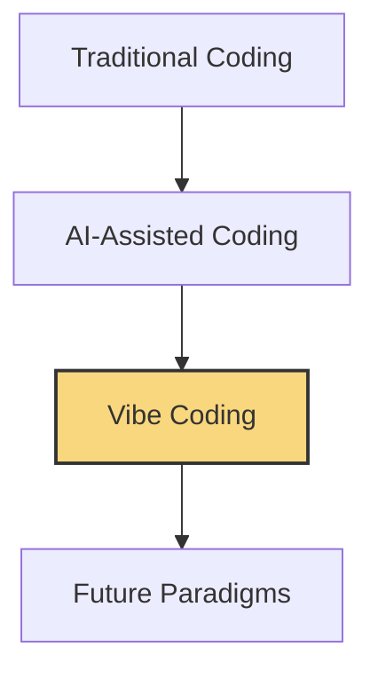

<div align="center">

[](https://github.com/SquizAI/VibeCoding_1101_Book)

# 📚 VIBE CODING 101 📚
## *The Definitive Guide to Human-AI Collaborative Development*

</div>

<div align="center">


</div>

<div align="center">

> *"Vibe coding allows people to be software architects instead of engineers. I've seen engineers use this and act more as software architects and let the AI write all the code. I've also seen it be very effective for non-developers to be able to actually build the ideas that they've never been able to do before without hiring a programmer. In my opinion, it's going to lead to a huge shift in how programming happens and enable more people than ever to build software."*
> 
> **— Erik, CEO of Bolt.new**

</div>

<div align="center">

> *"The future of coding isn't about typing lines of syntax—it's about orchestrating ideas, shaping logic with intuition, and letting AI handle the grunt work. Vibe coding isn't just a method; it's a mindset—where creativity, collaboration, and flow replace rigid rules. The best coders of tomorrow won't just write code; they'll design experiences, automate solutions, and let the vibes guide the machine to create the next generation of software in minutes not months."*
> 
> **— Erik, CEO of Bolt.new**

</div>


<p align="center">
  
  
</p>

<p align="center">
<i>"Where human intuition and AI capabilities converge to create a revolutionary approach to software development"</i>
</p>

</div>

---

## 🌟 Welcome to Vibe Coding 101!

> "The future of programming isn't about developers being replaced by AI—it's about developers being amplified by AI in perfect harmony, achieving meta-creativity beyond what either could accomplish alone."

Vibe Coding is a revolutionary approach to software development born from the harmonious fusion of human intuition and AI capabilities. This ebook itself is a testament to meta-creativity—created through the synchronized dance of human vision and AI implementation, demonstrating the very principles it teaches. It provides a comprehensive guide to mastering this new art form of collaborative development, regardless of your current skill level.

### 🔥 Why Vibe Coding Matters in 2025

<table>
  <tr>
    <td width="70%">
      <p>As we navigate 2025, the landscape of software development has fundamentally transformed. Traditional coding approaches are being transcended through meta-creativity—the harmonic resonance between human intuition and AI processing power.</p>
      <p>Vibe Coding isn't just a technique—it's a profound evolutionary leap in human-machine symbiosis. It represents the next level of training where humans and AI synchronize their unique capabilities, resonating at frequencies that unlock creativity, efficiency, and innovation previously thought impossible.</p>
    </td>
    <td width="30%" align="center">
      <h3>Key Benefits</h3>
      ✅ 10x Development Speed<br/>
      ✅ Enhanced Code Quality<br/>
      ✅ Reduced Technical Debt<br/>
      ✅ Lower Learning Barriers<br/>
      ✅ Increased Innovation<br/>
    </td>
  </tr>
</table>

---

## 📖 Book Structure

This ebook is designed to meet you where you are on your development journey. Each chapter is available in three distinct skill levels:

<div align="center">
  <table>
    <tr>
      <td align="center"><b>🌱 BEGINNER</b></td>
      <td align="center"><b>🚀 ADVANCED</b></td>
      <td align="center"><b>⚡ NINJA</b></td>
    </tr>
    <tr>
      <td>For those new to programming or just starting with AI assistance</td>
      <td>For experienced developers looking to enhance their existing workflows</td>
      <td>For experts pushing the boundaries of what's possible with AI collaboration</td>
    </tr>
  </table>
</div>

### 📑 Comprehensive Chapter Guide

<table>
  <tr>
    <th>Chapter</th>
    <th>Description</th>
    <th>What You'll Learn</th>
  </tr>
  <tr>
    <td><b><a href="./Chapter_01_The_Vibe_Coding_Revolution/README.md">Chapter 1:<br>The Vibe Coding Revolution</a></b></td>
    <td>Introduction to the revolutionary paradigm of AI-assisted development that's transforming the software industry in 2025.</td>
    <td>
      <ul>
        <li>Core Vibe Coding principles and methodologies</li>
        <li>Evolution from traditional to AI-assisted development</li>
        <li>The AI collaboration mindset and workflow</li>
        <li>Setting up your Vibe Coding environment</li>
      </ul>
    </td>
  </tr>
  <tr>
    <td><b><a href="./Chapter_02_Getting_Started/README.md">Chapter 2:<br>Getting Started with Vibe Coding</a></b></td>
    <td>A practical guide to establishing your Vibe Coding workflow, from selecting the right tools to completing your first AI-assisted project.</td>
    <td>
      <ul>
        <li>Blueprint-first development approach</li>
        <li>Effective communication patterns with AI</li>
        <li>Setting up your AI-assisted development environment</li>
        <li>Building your first Vibe Coding project</li>
      </ul>
    </td>
  </tr>
  <tr>
    <td><b><a href="./Chapter_03_Building_Real_Projects/README.md">Chapter 3:<br>Building Real Projects</a></b></td>
    <td>Applying Vibe Coding to real-world projects across different application types and complexity levels.</td>
    <td>
      <ul>
        <li>Translating requirements into effective AI prompts</li>
        <li>Building complete applications with AI assistance</li>
        <li>Implementing advanced features and integrations</li>
        <li>Testing and debugging strategies in AI-assisted workflows</li>
      </ul>
    </td>
  </tr>
  <tr>
    <td><b><a href="./Chapter_04_Backend_Development/README.md">Chapter 4:<br>Backend Development</a></b></td>
    <td>Mastering AI-assisted backend development, from API design to database integration and server deployment.</td>
    <td>
      <ul>
        <li>Designing robust APIs with AI guidance</li>
        <li>Efficient database schema development</li>
        <li>Building authentication and authorization systems</li>
        <li>Performance optimization techniques</li>
      </ul>
    </td>
  </tr>
  <tr>
    <td><b><a href="./Chapter_05_Full_Stack/README.md">Chapter 5:<br>Full Stack Development</a></b></td>
    <td>Creating complete full-stack applications with seamless integration between frontend, backend, and database components.</td>
    <td>
      <ul>
        <li>Front-end development with AI assistance</li>
        <li>Integrating frontend and backend systems</li>
        <li>State management and data flow optimization</li>
        <li>Building responsive, accessible user interfaces</li>
      </ul>
    </td>
  </tr>
  <tr>
    <td><b><a href="./Chapter_06_Advanced_Prompt_Engineering/README.md">Chapter 6:<br>Advanced Prompt Engineering</a></b></td>
    <td>Taking your AI communication skills to the next level with sophisticated prompting techniques and patterns.</td>
    <td>
      <ul>
        <li>Structured prompt design methodologies</li>
        <li>Domain-specific prompting strategies</li>
        <li>Prompt patterns for complex development tasks</li>
        <li>Iterative refinement and optimization techniques</li>
      </ul>
    </td>
  </tr>
  <tr>
    <td><b><a href="./Chapter_07_Mobile_Development/README.md">Chapter 7:<br>Mobile Development</a></b></td>
    <td>Harnessing AI assistance to build native and cross-platform mobile applications with enhanced efficiency.</td>
    <td>
      <ul>
        <li>Mobile-specific AI prompting strategies</li>
        <li>Building native iOS and Android applications</li>
        <li>Cross-platform development techniques</li>
        <li>Mobile UI/UX optimization with AI guidance</li>
      </ul>
    </td>
  </tr>
  <tr>
    <td><b><a href="./Chapter_08_Data_Science/README.md">Chapter 8:<br>Data Science</a></b></td>
    <td>Applying Vibe Coding techniques to data analysis, visualization, and machine learning model development.</td>
    <td>
      <ul>
        <li>Data analysis and processing with AI assistance</li>
        <li>Creating compelling data visualizations</li>
        <li>Building and fine-tuning ML models</li>
        <li>Interpreting results and communicating insights</li>
      </ul>
    </td>
  </tr>
  <tr>
    <td><b><a href="./Chapter_09_Production_Capstone/README.md">Chapter 9:<br>Production Capstone</a></b></td>
    <td>Taking applications from development to production with AI-assisted deployment, monitoring, and optimization.</td>
    <td>
      <ul>
        <li>CI/CD implementation with AI guidance</li>
        <li>Cloud infrastructure configuration</li>
        <li>Monitoring and observability setup</li>
        <li>Performance optimization and security hardening</li>
      </ul>
    </td>
  </tr>
  <tr>
    <td><b><a href="./Chapter_10_Collaboration/README.md">Chapter 10:<br>AI-Augmented Team Collaboration</a></b></td>
    <td>Transforming team dynamics by integrating AI tools into collaborative development workflows.</td>
    <td>
      <ul>
        <li>AI-assisted code reviews and quality assurance</li>
        <li>Knowledge sharing and context preservation</li>
        <li>Collective intelligence in development teams</li>
        <li>Onboarding and skill development systems</li>
      </ul>
    </td>
  </tr>
  <tr>
    <td><b><a href="./Chapter_11_Ethics/README.md">Chapter 11:<br>Ethics of AI-Assisted Development</a></b></td>
    <td>Navigating the ethical dimensions and implications of AI-assisted development practices.</td>
    <td>
      <ul>
        <li>Ethical frameworks for responsible AI use</li>
        <li>Bias detection and mitigation strategies</li>
        <li>Attribution and transparency best practices</li>
        <li>Governance systems for ethical AI adoption</li>
      </ul>
    </td>
  </tr>
  <tr>
    <td><b><a href="./Chapter_12_Future/README.md">Chapter 12:<br>The Future Beyond Vibe Coding</a></b></td>
    <td>Exploring emerging trends and future possibilities that extend beyond current AI-assisted development practices.</td>
    <td>
      <ul>
        <li>Multimodal development interfaces</li>
        <li>Intent-driven development paradigms</li>
        <li>Human-AI symbiotic systems</li>
        <li>Self-evolving software organisms</li>
      </ul>
    </td>
  </tr>
</table>

---

## 📖 How to Use This Book

This repository contains the complete Vibe Coding 101 book as a collection of markdown files organized by chapter.

<div align="center">

### [📚 Start Reading Now](#comprehensive-chapter-guide)

</div>

### 🛠️ Reading Options

1. **Browse Online**: Navigate the book directly on GitHub by clicking through chapter folders
2. **Download for Offline Reading**: Clone or download the repository to read markdown files locally
3. **Generate PDF/EPUB**: Convert to your preferred format using tools like Pandoc or markdown converters

```bash
# Clone the repository for local reading
git clone https://github.com/SquizAI/VIbeCoding_1101_Book.git

# Navigate to the book directory
cd VIbeCoding_1101_Book

# Start with the main README and follow chapter links
# Each chapter has beginner, advanced, and ninja-level content
```

---

## 🤝 Join the Vibe Coding Community

<table>
  <tr>
    <td width="33%" align="center">
      <h3>🌐 Connect</h3>
      <p>Join our <a href="#">Discord Server</a> to meet other Vibe Coders</p>
    </td>
    <td width="33%" align="center">
      <h3>🔄 Contribute</h3>
      <p>Help improve the book by submitting PRs or issues</p>
    </td>
    <td width="33%" align="center">
      <h3>🚀 Share</h3>
      <p>Spread the word and showcase your Vibe Coding projects</p>
    </td>
  </tr>
</table>

---

## 📊 The State of Vibe Coding in 2025



---

## 📝 How to Use This Repository

1. **Read the Book**: Start with Chapter 1 and progress through at your own pace, following your appropriate skill level
2. **Try the Examples**: Experiment with the interactive app to see Vibe Coding techniques in action
3. **Practice**: Apply the concepts in your own projects, starting small and scaling up
4. **Share**: Contribute your experiences and innovations back to the community

---

## ⚖️ License Information

© 2025 SquizAI. All rights reserved.

This educational material is provided for personal use and learning. Redistribution or commercial use is prohibited without explicit permission from the copyright holder.

---

<div align="center">
<p>Created with 💖 through meta-creative harmony between human vision and AI implementation</p>
<p>This book is both the message and the medium—demonstrating the future it describes</p>
<p>Powered by <a href="https://github.com/SquizAI">SquizAI</a></p>
</div>
